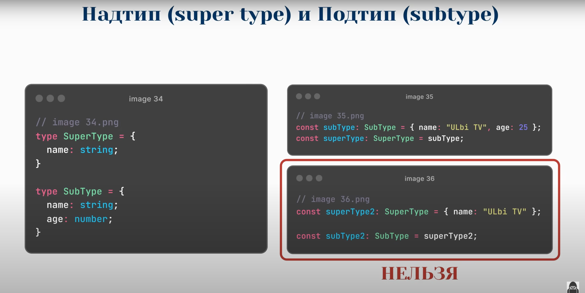
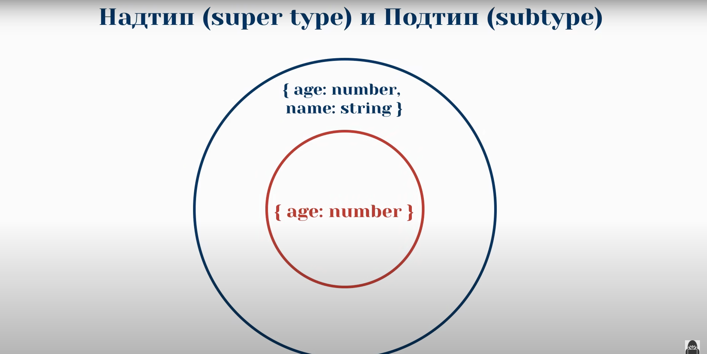

# Надтип (super type) и Подтип (subtype)

> Подтип включает все свойства и/или методы надтипа, плюс может добавлять свои.
---
> Надтип может сожержать меньше свойств и/или методов, чем подтип.
---
> Объект подтипа может быть присвоен переменной надтипа. Обратное не всегда возможно без приведения типов.

