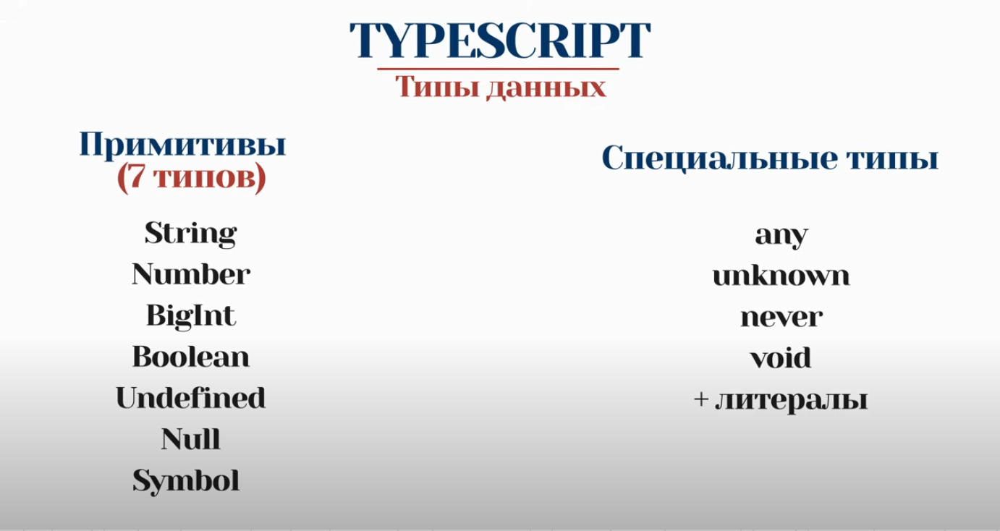
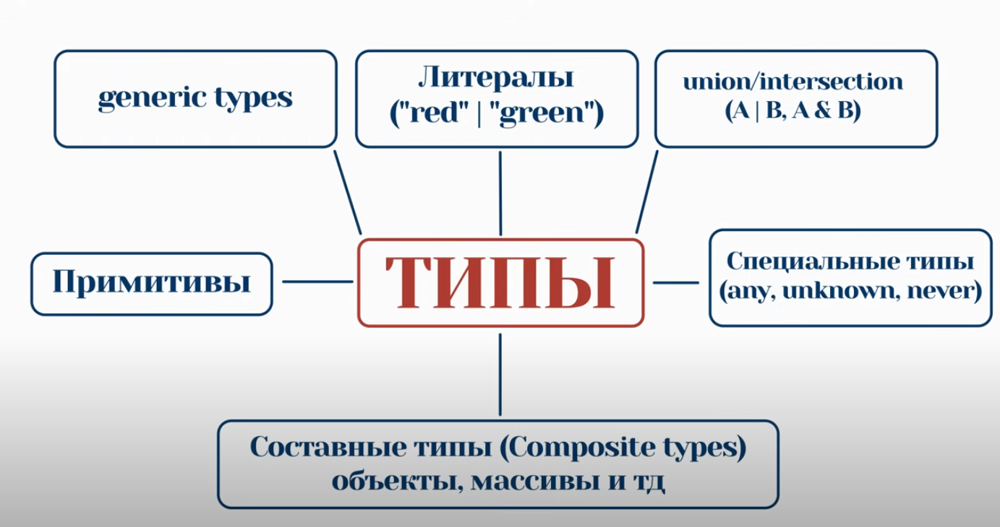
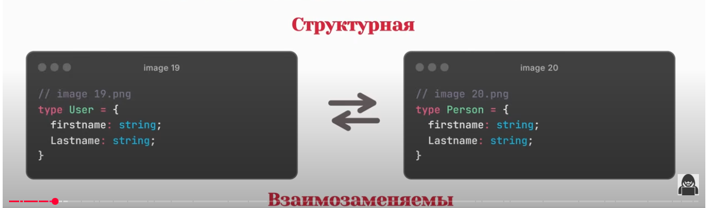

# JavaScript:
### Типы данных:
- Примитивы: String, Number, BigInt, Boolean, Undefined, Null, Symbol
- Oбъекты (ссылочные типы данных): Объекты, функции, массивы, Date, и тд (По факту это всё объекты)
---
# TypeScript

- TypeScript является надмножеством над JavaScript (содержит в себе всё что есть в JavaScript но расширяет его добавляет всё что связанно с типизацией).
- Язык со статической типизацией(явной или выводимой + струкитурной)
### Типы данных:



---
### Типизация:
    Статическая типизация - типы проверяются на этапе компиляции, а не выполнения
    
Явная типизация: 
```ts
let variable: number = 5; 
 ```

Выводимая типизация:
```ts
let variable = 5; 
 ```

Структурная типизация:


---